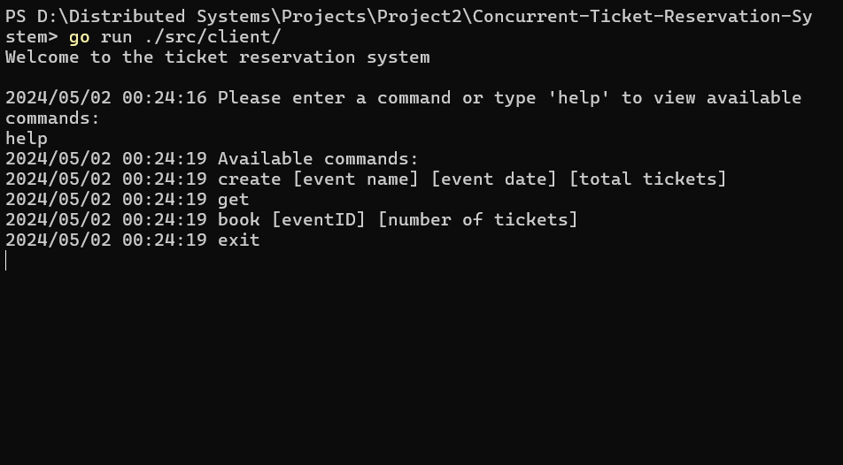
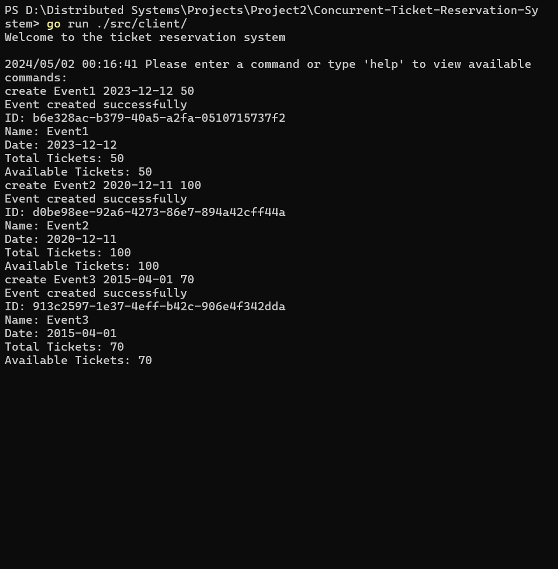
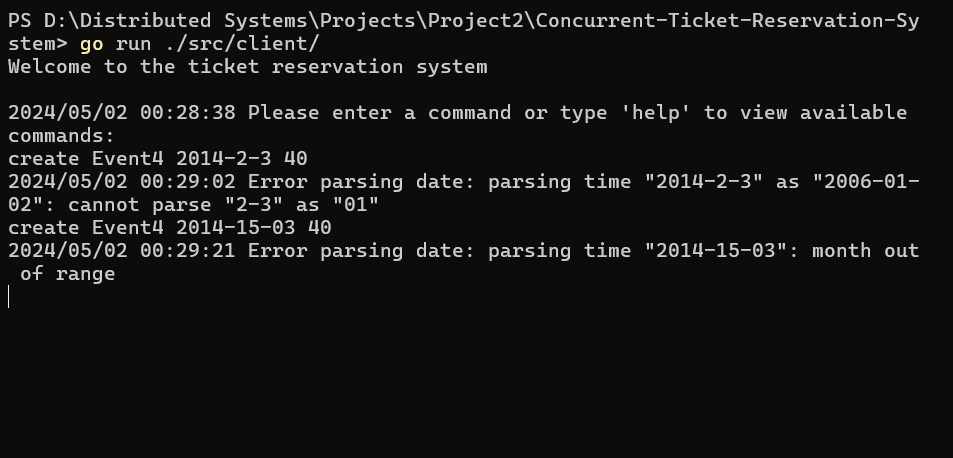
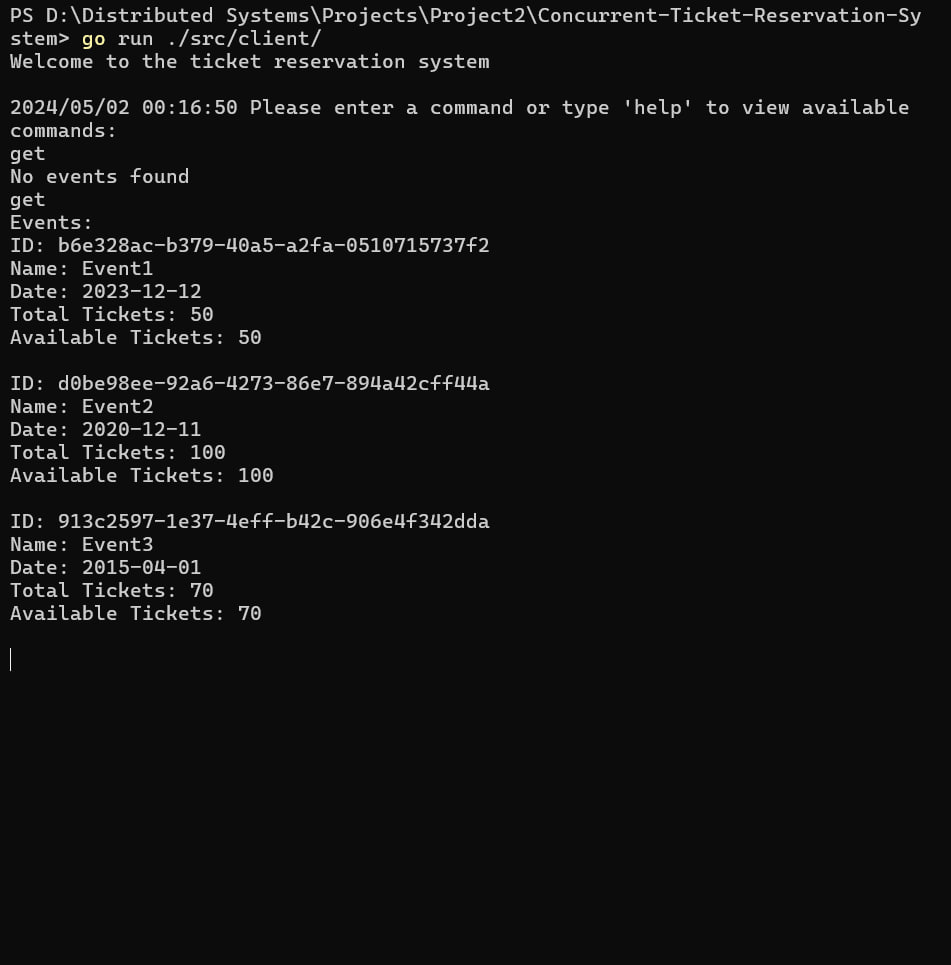

# Concurrent Ticket Reservation System

This is a simple ticket reservation system implemented using Go that allows multiple users. The system is designed to be concurrent and can handle multiple requests at the same time. The system is implemented using Go's built-in concurrency features like goroutines and channels.

- [Structure and Implementation](#structure-and-implementation)
  - [Client](#client)
    - [client](#client)
    - [clientHandler](#clientHandler)
  - [Server](#server)
    - [server](#server)
    - [utils](#utils)
  - [Event](#event)
  - [Ticket](#ticket)
  - [TicketService](#ticketService)
- [Contributors](#contributors)
- [Results](#results)
  - [Help](#help)
  - [Get Events](#get-events)
  - [Create Event](#create-event)
  - [Book Event](#book-event)

## Structure and Implementation

The system is divided into two main components: the client and the server. The client is responsible for sending requests to the server, while the server is responsible for processing these requests and managing the ticket reservation system.

We used the `"net/http"` library for handling http requests and responses. The `net/http` package in Go utilizes goroutines and concurrency to handle HTTP requests efficiently and asynchronously. It is designed around a concurrency model where each incoming HTTP request is handled by its own goroutine. This means that when a client sends an HTTP request to a server, the server creates a new goroutine to handle that request. This allows the server to continue accepting and processing new incoming requests concurrently without blocking. Each goroutine handles one request at a time, allowing the server to handle multiple requests simultaneously.

## Client

### Client

The client is implemented as a simple command-line interface that allows users to interact with the ticket reservation system. The client sends requests to the server and waits for the server's response. In this file, we implement three handler for the client.The client consist of a custom `Client` struct, which encapsulates an http.Client along with two URLs specific to handling events and reservations.

```go
type Client struct {
	httpClient *http.Client
	eventURL   string
	reserveURL string
}
```

**`Response`:** We define a Response struct containing a slice of pointers to Event structs.
We specify the JSON tag json:"events" for the Events field to define its name in JSON encoding and decoding. We demonstrate how to unmarshal JSON data representing a response into a Response struct and access the list of events contained in the response.

```go
type Response struct {
	Events []*Event `json:"events"`
}
```

This part has the following methods:
`NewClinet()`: This part of the function initializes and configures a new instance of the Client struct. It creates an http.Client instance (httpClient) and configures its properties, such as Timeout and Transport. In Go's net/http package, you can control the number of concurrent requests by setting the MaxIdleConns and MaxIdleConnsPerHost fields of the http.Transport struct. These fields define the maximum number of idle (keep-alive) connections that can be maintained per host and in total. This is like a semaphore that is used to control access to a shared resource with limited capacity.  
`Timeout`: Sets the maximum amount of time the client waits for a response from the server. In this case, it's set to 10 seconds.  
`Transport`: Configures the HTTP transport settings. It includes properties like `MaxIdleConns` and `MaxIdleConnsPerHost`, which define the maximum number of idle connections that can be maintained.

```go
func NewClient(eventURL, reserveURL string) *Client {
	return &Client{
		httpClient: &http.Client {
			Timeout: 10 * time.Second,
			Transport: &http.Transport {
				MaxIdleConns: 20,
				MaxIdleConnsPerHost: 10,
			},
		},
		eventURL:   eventURL,
		reserveURL: reserveURL,
	}
}
```

`GetEventsHandler()` This function handles the logic for retrieving events from a server using an HTTP GET request and processing the response. It takes a single argument args, which is a slice of strings representing command-line arguments. In this case, the function expects no arguments (len(args) == 0). The function sends an HTTP GET request to the eventURL specified in the Client struct. It reads the response body and decodes the JSON data into a Response struct. If the response status code is not http.StatusOK (200), it logs an error message. Otherwise, it prints the list of events contained in the response. The PrintListOfEvents function is a helper function that prints the event details in a formatted way.

```go
func (c *Client) CreateEventHandler(args []string) {
	if len(args) != 3 {
		log.Println("Invalid arguments for createEvent command")
		return
	}

	createEventBody, err := json.Marshal(map[string]interface{}{
		"name":          args[0],
		"date":          args[1],
		"total_tickets": args[2],
	})

	if err != nil {
		log.Println("Error marshalling JSON:", err)
		return
	}
	url := fmt.Sprintf("%screate", c.reserveURL)
	req, err := http.NewRequest("POST", url, bytes.NewBuffer(createEventBody))

	if err != nil {
		log.Println("Error creating request:", err)
		return
	}

	req.Header.Set("Content-Type", "application/json")

	resp, err := c.httpClient.Do(req)
	if err != nil {
		log.Println("Error sending request:", err)
		return
	}
	defer resp.Body.Close()

	body, err := ioutil.ReadAll(resp.Body)
	if err != nil {
		log.Println("Error reading response:", err)
		return
	}

	if resp.StatusCode != http.StatusOK {
		log.Println("Unexpected status code:", resp.StatusCode)
		return
	}

	PrintCreateEvent(body)
}
```

`BookEventHandler` books tickets for a specific event. The client sends a request to the server to book tickets for a specific event. The server then processes the request and books the tickets.

```go
func (c *Client) BookTicketsHandler(args []string) {
	if len(args) != 2 {
		fmt.Println("Invalid arguments for bookEvents command")
		return
	}

	eventID := args[0]
	numTickets, err := strconv.Atoi(args[1])
	if err != nil {
		log.Println("Invalid number of tickets:", err)
		return
	}

	ticketResponse, err := json.Marshal(map[string]interface{}{
		"event_id":   args[0],
		"ticket_ids": args[1],
	})

	url := fmt.Sprintf("%s%s/reserve?num_tickets=%d", c.reserveURL, eventID, numTickets)
	resp, err := c.httpClient.Post(url, "", bytes.NewBuffer(ticketResponse))
	if err != nil {
		log.Println("Error sending request:", err)
		return
	}
	defer resp.Body.Close()

	body, err := ioutil.ReadAll(resp.Body)
	if err != nil {
		log.Println("Error reading response:", err)
		return
	}

	if resp.StatusCode != http.StatusOK {
		log.Println("Unexpected status code:", resp.StatusCode)
		return
	}

	PrintBookTickets(body)
}
```

**`CreateEventHandler()`:** It first checks if the length of the args slice is not equal to 3. If it's not, it logs an error message indicating that the arguments are invalid for the createEvent command and returns. It then creates the request and sets the headers. It uses `httpClient.Do(req)` to execute the request and obtain a response. It reads the response body using `ioutil.ReadAll(resp.Body)`. If there's an error reading the response body, it logs the error and returns.

```go
func (c *Client) CreateEventHandler(args []string) {
	if len(args) != 3 {
		log.Println("Invalid arguments for createEvent command")
		return
	}

	createEventBody, err := json.Marshal(map[string]interface{}{
		"name":          args[0],
		"date":          args[1],
		"total_tickets": args[2],
	})

	if err != nil {
		log.Println("Error marshalling JSON:", err)
		return
	}
	url := fmt.Sprintf("%screate", c.reserveURL)
	req, err := http.NewRequest("POST", url, bytes.NewBuffer(createEventBody))

	if err != nil {
		log.Println("Error creating request:", err)
		return
	}

	req.Header.Set("Content-Type", "application/json")

	resp, err := c.httpClient.Do(req)
	if err != nil {
		log.Println("Error sending request:", err)
		return
	}
	defer resp.Body.Close()

	body, err := ioutil.ReadAll(resp.Body)
	if err != nil {
		log.Println("Error reading response:", err)
		return
	}

	if resp.StatusCode != http.StatusOK {
		log.Println("Unexpected status code:", resp.StatusCode)
		return
	}

	PrintCreateEvent(body)
}
```

### clientHandler

`clientHandler` is responsible for handling the client's requests and sending them to the server. The client handler is implemented as a simple command-line interface that allows users to interact with the ticket reservation system. The client handler supports the following commands:

- `get`: Get a list of all available events.
- `book [eventID] [number of tickets]`: Book tickets for a specific event.
- `create [event name] [event date] [total tickets]`: Create a new event.

```go
func GetInput(Client *Client) {
	scanner := bufio.NewScanner(os.Stdin)
	log.Println("Please enter a command or type 'help' to view available commands: ")
	for scanner.Scan() {
		commandParts := strings.Split(scanner.Text(), " ")
		command := commandParts[0]
		var args []string
		if len(commandParts) > 1 {
			args = commandParts[1:]
		}

		switch command {
		case "get":
			Client.GetEventsHandler(args)
		case "book":
			Client.BookTicketsHandler(args)
		case "create":
			Client.CreateEventHandler(args)
		case "help":
			HelpHandler()
		case "exit":
			ExitHandler()
		default:
			log.Println("Invalid command. Type 'help' to view available commands")
		}
	}
}
```

## Server

### Server

We used the `"net/http"` library for handling http requests and responses. The `net/http` package in Go utilizes goroutines and concurrency to handle HTTP requests efficiently and asynchronously. It is designed around a concurrency model where each incoming HTTP request is handled by its own goroutine. This means that when a client sends an HTTP request to a server, the server creates a new goroutine to handle that request. This allows the server to continue accepting and processing new incoming requests concurrently without blocking. Each goroutine handles one request at a time, allowing the server to handle multiple requests simultaneously.

When the server starts, it loads the events and tickets from the data file. The server then listens for incoming HTTP requests on the specified port. When a request is received, the server routes the request to the appropriate handler based on the request method and path. There are four main handlers in the server:
`GetEventsHandler` handles GET requests to the `/events` endpoint. It returns a list of all available events.
`CreateEventHandler` handles POST requests to the `/create` endpoint. It creates a new event with the specified name, date, and total number of tickets.
`BookTicketsHandler` handles POST requests to the `/reserve` endpoint. It books tickets for a specific event.
`LoadEvents` loads the events from the data file when the server starts. It reads the events from the file and decodes the JSON data into a slice of Event structs.

```go
func Run(port string) {

	createServerLogFile()

	ts := TicketService.TicketService{}

	loadData(&ts)


	http.HandleFunc("/", GetHomePageHandler)

	http.HandleFunc("/events", func(w http.ResponseWriter, r *http.Request) {
		GetListEventsHandler(w, r, &ts)
	})

	http.HandleFunc("/events/{eventID}/reserve", func(w http.ResponseWriter, r *http.Request) {
		BookTicketsHandler(w, r, &ts)
	})

	http.HandleFunc("/events/create", func(w http.ResponseWriter, r *http.Request) {
		CreateEventHandler(w, r, &ts)
	})

	startServer(port)
}

```

### utils

The utils file contains helper functions that are used by the server to `CreateEventHandler`, `BookTicketsHandler` and `GetListEventsHandler`. The `CreateEventHandler` function reads the request body and decodes the JSON data into a CreateEventRequest struct. It then creates a new event with the specified name, date, and total number of tickets using the CreateEvent function from the TicketService. The function then encodes the event into JSON and writes the response back to the client. The `BookTicketsHandler` function reads the request body and decodes the JSON data into a BookTicketsRequest struct. It then books tickets for the specified event using the BookTickets function from the TicketService. The function then encodes the ticket IDs into JSON and writes the response back to the client. The `GetListEventsHandler` function retrieves a list of all available events using the ListEvents function from the TicketService. It then encodes the list of events into JSON and writes the response back to the client.

`GetListEventsHandler` function handles the logic for retrieving events from a server using an HTTP GET request and processing the response. It takes a single argument args, which is a slice of strings representing command-line arguments. In this case, the function expects no arguments (len(args) == 0). The function sends an HTTP GET request to the eventURL specified in the Client struct. It reads the response body and decodes the JSON data into a Response struct. If the response status code is not http.StatusOK (200), it logs an error message. Otherwise, it prints the list of events contained in the response. The PrintListOfEvents function is a helper function that prints the event details in a formatted way.

```go
func GetListEventsHandler(w http.ResponseWriter, r *http.Request, ts *TicketService.TicketService) {
	log.Println("USER: GET /events")
	events := ts.ListEvents()

	response, err := json.Marshal(events)
	if err != nil {
		http.Error(w, fmt.Sprintf("Error encoding response: %v", err), http.StatusInternalServerError)
		log.Println("Error encoding response: %v", err)
		return
	}

	w.Header().Set("Content-Type", "application/json")
	w.WriteHeader(http.StatusOK)
	w.Write(response)
}
```

`BookTicketsHandler` function handles the logic for booking tickets for a specific event using an HTTP POST request and processing the response. It takes a single argument args, which is a slice of strings representing command-line arguments. The function expects two arguments: the event ID and the number of tickets to book. The function sends an HTTP POST request to the reserveURL specified in the Client struct with the event ID and number of tickets as query parameters. It reads the response body and decodes the JSON data into a Response struct. If the response status code is not http.StatusOK (200), it logs an error message. Otherwise, it prints the list of ticket IDs contained in the response. The PrintBookTickets function is a helper function that prints the ticket IDs in a formatted way.

```go
func BookTicketsHandler(w http.ResponseWriter, r *http.Request, ts *TicketService.TicketService) {

	parsedURL, err := url.Parse(r.URL.String())
	if err != nil {
		http.Error(w, fmt.Sprintf("Error parsing URL: %v", err), http.StatusBadRequest)
		log.Println("Error parsing URL: %v", err)
		return
	}

	pathParts := strings.Split(parsedURL.Path, "/")
	if len(pathParts) < 3 {
		http.Error(w, "Invalid URL format: eventID not found", http.StatusBadRequest)
		log.Println("Invalid URL format: eventID not found")
		return
	}
	eventID := pathParts[2]

	numTicketsStr := r.URL.Query().Get("num_tickets")
	numTickets, err := strconv.Atoi(numTicketsStr)
	if err != nil {
		http.Error(w, fmt.Sprintf("Error parsing num_tickets: %v", err), http.StatusBadRequest)
		log.Println("Error parsing num_tickets: %v", err)
		return
	}

	log.Println("USER: GET /events/" + eventID + "/tickets?num_tickets=" + numTicketsStr)

	ticketIDs, err := ts.BookTickets(eventID, numTickets)
	if err != nil {
		http.Error(w, fmt.Sprintf("Error booking tickets: %v", err), http.StatusInternalServerError)
		log.Println("Error booking tickets: %v", err)
		return
	}

	response, err := json.Marshal(ticketIDs)
	if err != nil {
		http.Error(w, fmt.Sprintf("Error encoding response: %v", err), http.StatusInternalServerError)
		log.Println("Error encoding response: %v", err)
		return
	}

	w.Header().Set("Content-Type", "application/json")
	w.WriteHeader(http.StatusOK)
	w.Write(response)

	log.Printf("Booked %v tickets for event %s", ticketIDs, eventID)
}
```

`CreateEventHandler` function handles the logic for creating a new event using an HTTP POST request and processing the response. It takes a single argument args, which is a slice of strings representing command-line arguments. The function expects three arguments: the event name, date, and total number of tickets. The function sends an HTTP POST request to the createURL specified in the Client struct with the event name, date, and total number of tickets as JSON data in the request body. It reads the response body and decodes the JSON data into a Response struct. If the response status code is not http.StatusOK (200), it logs an error message. Otherwise, it prints the event details contained in the response. The PrintCreateEvent function is a helper function that prints the event details in a formatted way.

```go
func CreateEventHandler(w http.ResponseWriter, r *http.Request, ts *TicketService.TicketService) {
	type CreateEventResponse struct {
		Name  string `json:"name"`
		Date  string `json:"date"`
		Total string `json:"total_tickets"`
	}

	var req CreateEventResponse
	err := json.NewDecoder(r.Body).Decode(&req)
	if err != nil {
		http.Error(w, fmt.Sprintf("Error decoding request: %v", err), http.StatusBadRequest)
		log.Println("Error decoding request: %v", err)
		return
	}

	name := req.Name
	dateStr := req.Date
	date, err := time.Parse("2006-01-02", dateStr)
	if err != nil {
		http.Error(w, fmt.Sprintf("Error parsing date: %v", err), http.StatusBadRequest)
		log.Println("Error parsing date: %v", err)
		return
	}
	totalTickets, err := strconv.Atoi(req.Total)
	if err != nil {
		http.Error(w, fmt.Sprintf("Error parsing total_tickets: %v", err), http.StatusBadRequest)
		log.Println("Error parsing total_tickets: %v", err)
		return
	}

	event, err := ts.CreateEvent(name, date, totalTickets)
	if err != nil {
		http.Error(w, fmt.Sprintf("Error creating event: %v", err), http.StatusInternalServerError)
		log.Println("Error creating event: %v", err)
		return
	}

	log.Printf("USER: POST /events\nCreated event %s with %d tickets", event.ID, event.TotalTickets)

	response, err := json.Marshal(event)
	if err != nil {
		http.Error(w, fmt.Sprintf("Error encoding response: %v", err), http.StatusInternalServerError)
		log.Println("Error encoding response: %v", err)
		return
	}

	w.Header().Set("Content-Type", "application/json")
	w.WriteHeader(http.StatusOK)
	_, err = w.Write(response)
	if err != nil {
		http.Error(w, fmt.Sprintf("Error writing response: %v", err), http.StatusInternalServerError)
		return
	}

	log.Printf("Created event %s with %d tickets", event.ID, event.TotalTickets)
}
```

## Events

The Event struct is used to store the event information. The event information includes the ID, Name, Date, TotalTickets and AvailableTickets. Also a mutex is used for cuncurrent access to the event information and adding or removing events. The Event struct is defined as follows:

```go
type Event struct {
	ID   				string
	Name 				string
	Date 				time.Time
	TotalTickets		int
	AvailableTickets	int
}
```

## Ticket

The Ticket struct is used to store the ticket information. The ticket information includes the ID of the ticket and also the event ID. The Ticket struct is defined as follows:

```go
type Ticket struct {
	ID      string
	EventID string
}
```

## TicketService

The TicketService struct is used to store the ticket service information including a map of events (event ID to event) and a map of tickets (ticket ID to ticket). Also a mutex is used for concurrent access to the ticket service information. The TicketService struct is defined as follows:

```go
type TicketService struct {
	events sync.Map
	tickets sync.Map
	mutex sync.RWMutex
}

```

The TicketService has the following methods:

`BookTickets()` function loads the events in the beginning. the `Load()`function attempts to load the event with the given eventID from the events map of the TicketService. If the event is found, ok will be true, and event will contain the loaded value. If there are not enough available tickets for the event (i.e., the number of available tickets is less than the requested number of tickets), the function returns nil and an error indicating that there are not enough tickets available for the event. We also declare a slice to store the generated ticket IDs that have been reserved and update the number of available tickets of the event. We also lock this part by using `sync.RWMutex`to prevent access of more than one thread to the reservation otherwise two threads can each reserve 10 tickets of an event that has 10 available tickets left.

```go
func (ts *TicketService) BookTickets(eventID string, numTickets int) ([]string, error) {
	ts.mutex.Lock()
    defer ts.mutex.Unlock()

	event, ok := ts.events.Load(eventID)

	if !ok {
		return nil, fmt.Errorf("event ID %s not found", eventID)
	}

	ev := event.(*Event.Event)
	if ev.AvailableTickets < numTickets {
		return nil, fmt.Errorf("not enough tickets available for event %s", eventID)
	}

	var ticketIDs []string
	for i := 0; i < numTickets; i++ {
		ticket := &Ticket.Ticket{
			ID:      generateUUID(),
			EventID: eventID,
		}
		ts.tickets.Store(ticket.ID, ticket)
		ticketIDs = append(ticketIDs, ticket.ID)
	}

	ev.AvailableTickets -= numTickets
	ts.events.Store(eventID, ev)

	return ticketIDs, nil
}
```

`ListEvents()` function returns a slice of all events in the ticket service. The function uses the Range() function to iterate over all the events in the events map of the TicketService and appends the event to the slice of events. The function then returns the slice of events. By acquiring a read lock (RLock), the method indicates that it only intends to perform read operations on the TicketService's events data. The read lock allows multiple goroutines to read the data concurrently without interfering with each other. However, if a write operation is attempted while the read lock is held, the write operation will block until all read locks are released. This ensures that no writes occur concurrently with reads, preventing data races.

```go
func (ts *TicketService) ListEvents() []*Event.Event {
	ts.mu.RLock()
  	defer ts.mu.RUnlock()
	var events []*Event.Event
	ts.events.Range(func(key, value interface{}) bool {
		event := value.(*Event.Event)
		events = append(events, event)
		return true
	})
	return events
}
```

`GenerateUUID()` function generates a random UUID. The function generates a random UUID using the `rand.read()` function from the `crypto/rand` package. The function then sets the version bits and variant bits of the UUID and returns the UUID as a string.

```go
func generateUUID() string {
	uuid := make([]byte, 16)
	_, err := rand.Read(uuid)
	if err != nil {
		return ""
	}
	uuid[8] = (uuid[8] | 0x80) & 0xBF
	uuid[6] = (uuid[6] | 0x40) & 0x4F
	return fmt.Sprintf("%x-%x-%x-%x-%x", uuid[0:4], uuid[4:6], uuid[6:8], uuid[8:10], uuid[10:])
}
```

`CreateEvent()` function creates a new event with the given name, date, and total number of tickets. The function generates a new UUID for the event and then stores the event in the events map of the TicketService and returns the event. The critical section of the code, in this case, is where the TicketService is modified by creating a new event and storing it. By locking the mutex (ts.mu.Lock()) before entering this critical section and unlocking it (defer ts.mu.Unlock()) afterward, the code ensures that only one goroutine can execute this code block at a time. This prevents concurrent writes and ensures that the state of the TicketService remains consistent.

```go
func (ts *TicketService) CreateEvent(name string, date time.Time, totalTickets int) (*Event.Event, error) {
	ts.mu.Lock()
    defer ts.mu.Unlock()
	event := &Event.Event{
		ID:               generateUUID(),
		Name:             name,
		Date:             date,
		TotalTickets:     totalTickets,
		AvailableTickets: totalTickets,
	}

	go func() {
	ts.events.Store(event.ID, event)
	}()

	fmt.Println("event created", event.ID)

	return event, nil
}
```

## Fairness and Starvation Prevention

### Scheduling

The below code helps us to explain how golang implements fairness in threads. It uses an M:N mapping. This means M goroutines need to be mapped to N threads. So, users can create however many goroutines they want, but it schedules their goroutines on a thread for a certain period of time.

Golang has a global FIFO named `globalRunQueue`; Each thread picks a goroutine from this queue to execute it. But this is not enough since more than one thread can take a goroutine from `globalRunQueue` at the same time. We cannot use `mutex` since we need to pause and resume goroutines and we cannot pause a goroutine in the middle of a critical section. Another way we could think of is giving each thread its local run queue. In this case the mutex is not needed since the `localRunQueue` is only accessed by a single thread. The thread may fetch from the global run queue when its own local run queue is empty. Also when a thread's local run queue is empty, it can stead work from other local run queues. The problem happens when a goroutine performs a syscall that takes a long time to return and can cause long waiting for threads to get the system call finished. Golang solves this problem by creating a new thread just before a system call and after that the current threat sleeps during the system call (waits for it to finis and does not use OS resources). By this other problems like checking a lot of local run queues when having lots of threads can happen. Using `Processor` is a solution to some of these problems. each thread gets a `processor` that contains variables for code execution. The local run queue is also moved to the processor. The processor helps when a thread gets blocked on a system call; In this case the thread can release the processor and leave it to another thread.

### Fairness

- **Preemptoin**  
  A mechanism that pauses the goroutine if it takes longer than a certain period of time and adds it to the tail of the run queue is implemented
- **Global Run Queue Starvation**  
  The global run queue is polled occasionally to prevent starvation of goroutines in the global run queue. The global run queue is polled every 61st iteration of the scheduler loop. This ensures that goroutines in the global run queue are not starved and get a chance to run.

```go
void runThread() {
  // A simple variable to keep track of the number of goroutines
  // we are running
  int schedTick = 0;

  while (true) {
    // Occasionally poll the global run queue instead of the local run queue
    // 61 is the actual number they use to decide to poll the global run queue!
    // https://github.com/golang/go/blob/master/src/runtime/proc.go#L2753
    if (schedTick % 61 == 0) {
      // Polling the global run queue
      goroutine g = pollGlobalRunQueue()
      if (g != nil) {
        g();
      }
    }

    // Check if there is an empty goroutine
    bool isEmpty = this.processor.localRunQueue.empty();

    // If not empty
    if (!isEmpty) {
      goroutine g = this.processor.localRunQueue.getNextGoroutine();
      g();

      // Increment the schedTick variable
      schedTick ++;
    }
    else {
      // Steal work from other local run queues
      for (int i = 0; i < localRunQueueCount; i += 1) {
        // Check if there is an empty goroutine in this local run queue
        bool isEmpty = localRunQueues[i].empty();

        // If not, steal the next goroutine, and run it
        goroutine g = localRunQueues[i].getNextGoroutine();
        g();
      }
    }
  }
}
```

## Caching

Caching is implemented in sync.Map in golang. The data type is as the following:

```go
type Map struct {
   mu     Mutex
   read   atomic.Value // readOnly
   dirty  map[interface{}]*entry
   misses int
}

type readOnly struct {
   m       map[interface{}]*entry
   amended bool
}
```

`mu` is a mutex used to protect access to read and dirty.  
`read` is a read-only data structure supporting concurrent reads using atomic operations. It stores a readOnly structure that contains a map of entries.  
`dirty` is a map of entries for reading and writing data, requiring locking to ensure data security.  
`misses` is the number of cache misses.
`amended` is a boolean which indicates whether the read and dirty data are consistent.

Also the Entry structure is as follows and contains a pointer `p` that points to the value stored for the key.

```go
type entry struct {
   p unsafe.Pointer // *interface{}
}
```

### Reading Process

Reading from sync.Map happens as the following:  
At first it checks if the item exists in `read`. If it exists, it reads the data from it, otherwise it checks the `read.readOnly`. if the `amended` is `true` (indicating inconsistency), this data type search the dirty for the required item. Actually `read` acts as a cache

### Writing Process

Same as the reading process, sync.Map checks for the existence of the item in `read` firstly. If the element does not exist in `read`, we need to proceed to the `dirty` process; Before the updating or storing the value, a mutex lock is acquired to prevent inconsistency in `dirty` process.

### Deletion Process

Same as the reading and writing processes, sync.Maps checks `read` at first and make the deletion efficiently. If it does not exist in `read` and the `amended` is `true` a mutex lock is acquired. It then checks the `read` again; If the item still does not exist in `read`, the deletion is done in `dirty`.

## Contributors

- [Nesa Abbasi](https://github.com/Nesabbasi)
  - Implementing the server & client side of the project
  - Participating in writing code documentation
- [Ava Mirmohammadmahdi](https://github.com/avamirm)
  - Modify the server & client side of the project
  - Participating in writing code documentation
- [Amir Ali Vahidi](https://github.com/Mohta3b)
  - Handling the project structure
  - Implementing the server & client side of the project

## Results

### Help



### Create Event




### Get Events



### Book Event


